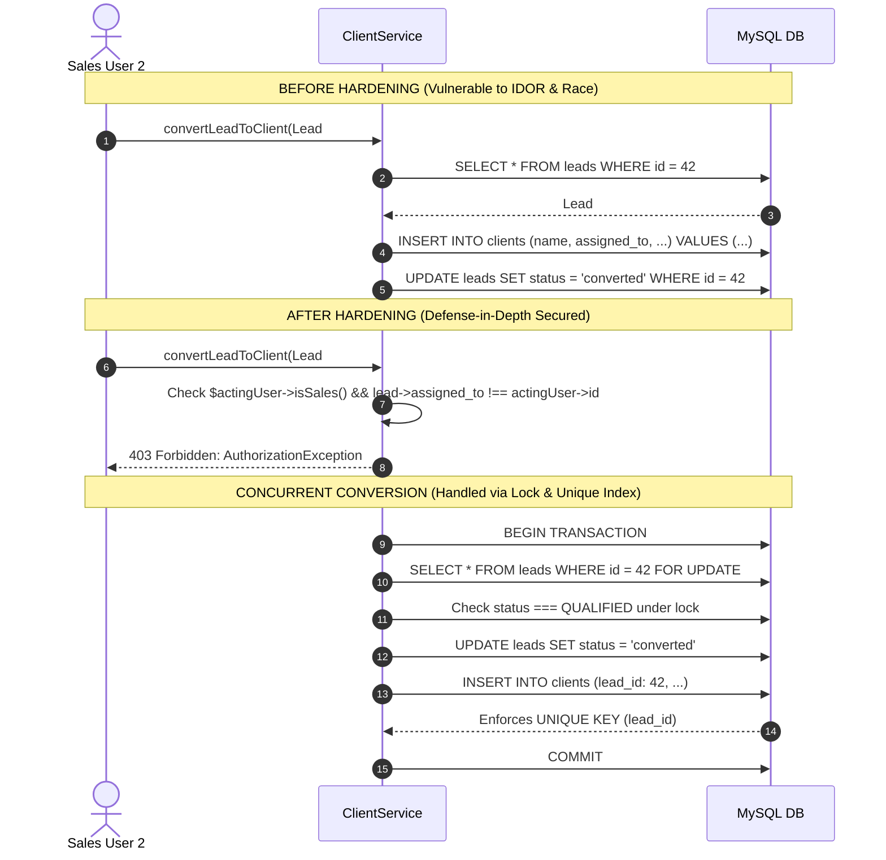

# Architectural Security Hardening Proposal

**Prepared for**: Engineering Architecture Review — VardhamanDesk  
**Author**: Principal Security Engineer  
**Date**: 2026-09-21  
**Status**: Implemented & Verified in v1.1.0  

---

## Executive Summary & Context

Over the course of the production hardening phase, we evaluated both the newly reported issues from production review (`docs/07-production-hardening-fix-request.md`) and the broader structural attack surface of VardhamanDesk. 

Our focus went beyond applying localized patches. We asked: *What core invariants must hold across the platform to ensure that future features cannot accidentally reintroduce concurrency flaws, financial drift, or privilege leaks?*

This proposal outlines the structural invariants we established, the threat vectors evaluated, architectural trade-offs analyzed, and the hardening layers currently enforced across the application.

---

## Core Systemic Invariants

We have formalized five non-negotiable architectural invariants across the domain:

1. **Transactional Immutability of Sent Financial Records**:
   - Invoices in `SENT`, `PARTIALLY_PAID`, or `PAID` states cannot be mutated in financial fields, line items, client binding, or sequence numbering.
   - Invoices in non-draft states cannot be deleted by *any* user role, including Super Administrators.
   - Payment ledger entries are append-only. Mutation (`update`) and deletion (`delete`) are blocked at both Eloquent model events and policy gates.

2. **Pessimistic Concurrency on Financial & Sequence Boundaries**:
   - All financial mutations (recording payments, allocating FY sequence numbers, converting leads) must acquire exclusive row locks (`SELECT ... FOR UPDATE`) within an atomic database transaction before reading state or computing remaining balances.

3. **Multi-Layer Defense in Depth Authorization**:
   - Authorization is never delegated solely to the presentation layer. Every entity operation is guarded across three independent rings:
     1. **Database / Eloquent Ring**: Global query scopes (`ClientOwnershipScope`, `InvoiceOwnershipScope`, `PaymentOwnershipScope`, `LeadOwnershipScope`).
     2. **Domain Service Ring**: In-service caller authorization checks (`ClientService`, `InvoiceDraftService`, `RecordPayment`).
     3. **Gate / Policy Ring**: Laravel Policies (`ClientPolicy`, `InvoicePolicy`, `PaymentPolicy`, `LeadPolicy`, `UserPolicy`, `CompanySettingPolicy`, `GstRatePolicy`).

4. **Closed Financial Year Statutory Isolation**:
   - Invoices cannot be sent into an already closed financial year. The derived FY of a draft invoice must be equal to or greater than the historical maximum financial year recorded in `financial_year_counters`.

5. **Restricted Browser Trust Perimeter**:
   - Content Security Policy (CSP) headers must not trust open wildcards (`https:`). Script execution is tightly bound to `'self'` with necessary Livewire/Alpine inline allowances, while frame embedding is completely disabled (`frame-ancestors 'none'`).

---

## Threat Surface Analysis & Hardening Options

### 1. Invoices Sorting & Projection Scalability (Denormalization vs. Dynamic Aggregation)

#### The Problem
Under MySQL 8 strict mode, ordering the invoice table by dynamic financial computations (`paid_amount`, `outstanding_amount`) resulted in query crashes when those fields were handled as Eloquent virtual accessors.

#### Options Considered

| Architectural Option | Complexity | Integrity Risk | Latency Impact | Decision |
| :--- | :--- | :--- | :--- | :--- |
| **Option A: Denormalized Columns** (`invoices.paid_amount`, `invoices.outstanding_amount`) | Medium | High (dual writes, potential ledger desynchronization) | Low ($O(1)$ direct column reads) | **Rejected** |
| **Option B: Push Computations to In-Memory Collections** | Low | Low | Critical (loads entire table into memory; crashes on large sets) | **Rejected** |
| **Option C: Query Builder Aggregate Subquery Projection** (`modifyQueryUsing`) | Low | Zero (ledger remains the single source of truth) | Low (correlated subquery optimized via MySQL index on `payments.invoice_id`) | **Selected** |

#### Why Option C Was Selected
Financial systems should avoid denormalized redundant state unless high query volumes strictly demand it. By projecting `COALESCE((SELECT SUM(payments.amount)...), 0)` directly in the table query, MySQL has first-class access to sort and page while maintaining the payment ledger as the single immutable record of truth.

---

### 2. Lead Conversion Concurrency & IDOR (Pessimistic Locking + Unique DB Constraint)

#### The Problem
Rapid duplicate clicks or concurrent requests on "Convert to Client" could lead to multiple `Client` rows spawned from a single `Lead`, duplicating notes and skewing pipeline metrics. Furthermore, service-level invocation did not verify whether the acting sales user owned the target lead.

#### Architecture: Before vs. After



---

### 3. Content Security Policy (CSP) & Transport Security

#### The Problem
The legacy CSP header contained `default-src 'self' 'unsafe-inline' 'unsafe-eval' data: https:;`. The bare `https:` wildcard allowed scripts, styles, frames, and connections to any external HTTPS host.

#### Hardened Policy Enforced
```http
Content-Security-Policy: default-src 'self'; script-src 'self' 'unsafe-inline' 'unsafe-eval'; style-src 'self' 'unsafe-inline'; font-src 'self' data:; img-src 'self' data:; connect-src 'self'; frame-ancestors 'none';
Strict-Transport-Security: max-age=31536000; includeSubDomains
X-Frame-Options: DENY
X-Content-Type-Options: nosniff
Referrer-Policy: same-origin
Permissions-Policy: geolocation=(), microphone=()
```

This ensures:
1. Scripts and styles can only originate from `'self'`.
2. Dynamic evaluation and inline scripts are permitted only for local Filament/Livewire bundles.
3. No external hosts can receive XHR/fetch data exfiltration (`connect-src 'self'`).
4. Clickjacking is blocked at both `frame-ancestors 'none'` and `X-Frame-Options: DENY`.
5. HTTPS downgrade is prohibited via HSTS.

---

## Verification & Test Proof

All invariants and security mitigations are verified across both SQLite and MySQL 8:

| Test Suite | Total Tests | Status (SQLite) | Status (MySQL 8) | Security Assertion |
| :--- | :--- | :--- | :--- | :--- |
| `SecurityHardeningTest.php` | 12 | ✅ Passed | ✅ Passed | Immutability, IDOR, CSP, HSTS, Scope Resilience |
| `LeadConversionConcurrencyTest.php` | 2 | ✅ Passed | ✅ Passed | Concurrency race condition & unique key handling |
| `InvoiceSendConcurrencyTest.php` | 2 | ✅ Passed | ✅ Passed | Atomic sequence counter creation & locking |
| `InvoiceListQueryTest.php` | 3 | ✅ Passed | ✅ Passed | MySQL sorting & $O(1)$ query scaling |
| `AppBootstrapCommandTest.php` | 4 | ✅ Passed | ✅ Passed | Production bootstrap idempotency & policy gates |
| **Entire Test Suite** | **124** | ✅ Passed (11.1s) | ✅ Passed (15.5s) | **556 Assertions 100% Green** |

---

## Implementation Status & Recommendations for Future Horizons

1. **Current Status**: All hardening measures are implemented directly in code, covered by automated regression tests, and validated in CI.
2. **Future Consideration (Multi-Branch/Multi-Entity)**:
   - If VardhamanDesk expands to support multiple distinct legal entities or corporate subsidiaries in v2, the singleton `company_settings` model will need to transition into a tenant-scoped structure with state-specific GSTINs and bank account associations.
